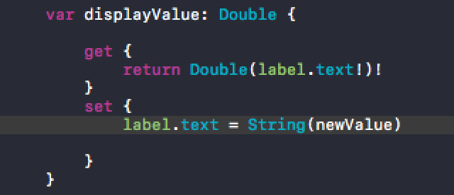
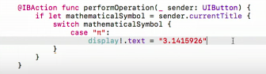
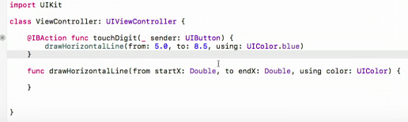
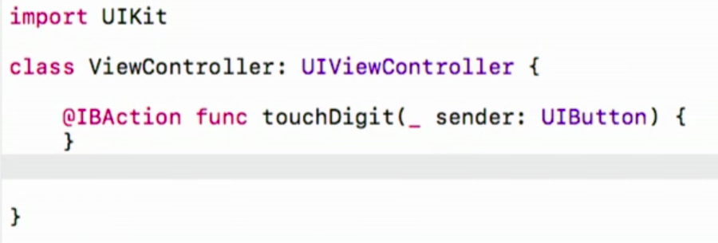
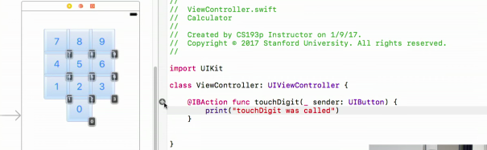

# Stanford_IOS_2017

## The Project - May 2017

After exactly a year of iOS development with Swift in Xcode I decided to give the Stanford iOS course a spin.  I had only heard great things about the course from many reputable collegues and it seems to have a flagship reputation in the mobile development world.

While I no longer consider myself a novice to iOS development mastery is indeed worlds away and I know that I have much to learn.  After a year of iOS development I feel like I have learned so much: Swift feels like my 2nd spoken language, the UI and it's reflexive element-positioning now feel in my control, and even the agony of Xcode and its infinite complexity feels conquerable (having navigated through so many circles of "Xcode Hell" in the past year).  

However, I have glaring weaknesses I'd like to address within this course.  

### TESTS 
Off the top of the list I'd like to become far more comfortable with test-driven development in iOS.  In my haste to expand my portfolio in Year1 I shelved writing tests for my iOS projects.  This is clearly not best practice and will certainly come back to haunt my future projects if not addressed directly.  

### DEBUGGING 
I've become quite accustomed to tracking and resolving bugs in my code quickly but this is something I can improve - I need to develop strategies to track, isolate, and resolve common bugs in lazer

### CORE SERVICES
While I've generally familiarized myself with many of the common Core Services available in iOS development I hope to further expand my knowledge and understanding of this spectrum of tools.

### SHORT-CUTS!
Every developer ALWAYS needs to learn anything and everything that can speed up the development process.  For me, this will be any and all shortcuts, ESPECIALLY keyboard shortcuts!

### OTHER SH*T
I'm sure there is a ton of things small and large that I've missed during Year1 - so for humilities sake I will fill the rest of this repository with kewl tricks that were previously not known or completely understood to me.  I actually don't care if I look like a fool for not understanding some of these tricks after a year as an iOS developer (flame on haterz).

So, here we go! In no particular order, cool tricks that were unknown or not clear to me until Professor Paul Hearty's iOS course:

# HEARTY FACTS & TIPS:

### Computed Values

Set a variable with its own computation built in.  GET and SET values:

### LET v. VAR
LET defines a constant - does not change
VAR is subject to change at any time 

### SWITCH/CASE v. IF/ELSE

NIFTY shortcut instead of unduley burdensome if/elses statements, HOWEVER it must be exhaustive - describe all possible cases

### STRUCT v. CLASS

* CLASS = inheritance
* STRUCT = orphans
* CLASS = lives in the heap and are pointed to
* STRUCT = does not live in the heap, gets passed around by copying
* CLASS = get referenced around the heap
* STRUCT = gets copied around the heap

## ARGUMENTS

No Kidding!  Did NOT know about setting up custom double-parameters.  The first is the external parameters used to call the method externally.  The 2nd parameters are internal which can be used within the method.

Underscore specifically means there is no external parameter - new to Swift3:

Copy/Paste a button and its associated action comes with it for each copy!

